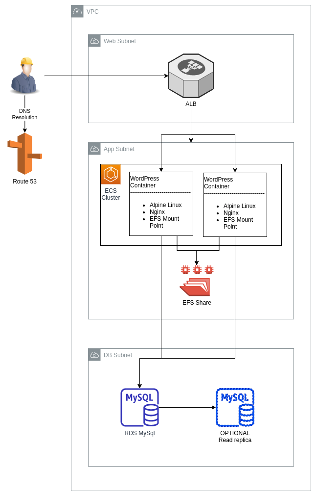

# Containerized-Wordpress-in-the-Cloud
Automate the deployment and management of cheap, high availability, containerized wordpress in the cloud. 

# Summary

## Containers
* Run Alpine Linux for it's exceedingly small footprint and lack of bloat
* Mount networked file system(EFS) for sharing wp-content allowing for ease of use and quick load times
* Sit behind ELB directing traffic and allowing for auto scaling
* HTTPS offload at loadbalancer for lower resource consumption
* Pick Apache or Nginx for web server
* Pick Wordpress version in deployment methodology

## Infrastrucutre as Code
* All infra deployments are automated with IaC tools for your convenience 
* CloudFront caching of uploaded files for quicker load times and less resource consumption
* Automated testing upon new container builds or infra changes
* Optional Aurora or MySql for cost savings vs HA

# How to use

This application is deployed with the AWS CDK. Navigate to the [WordpressEcsConstruct](AWS-Deployment-Automation/WordpressEcsConstruct) directory for instructions on how to deploy this application with the CDK.

# Useful info

https://aws.amazon.com/blogs/storage/optimizing-wordpress-performance-with-amazon-efs/